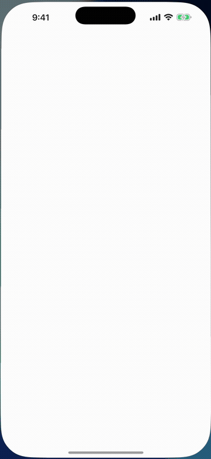
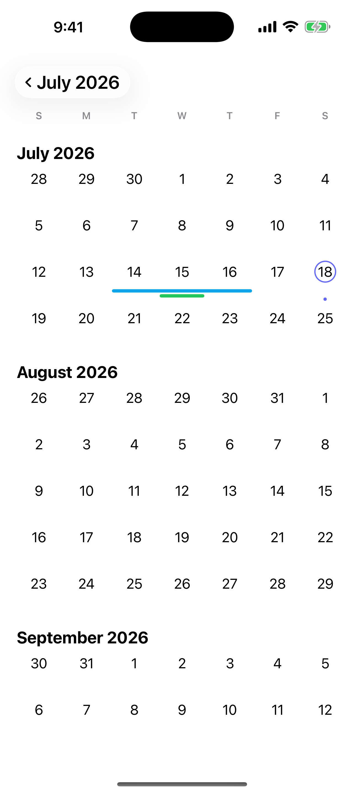
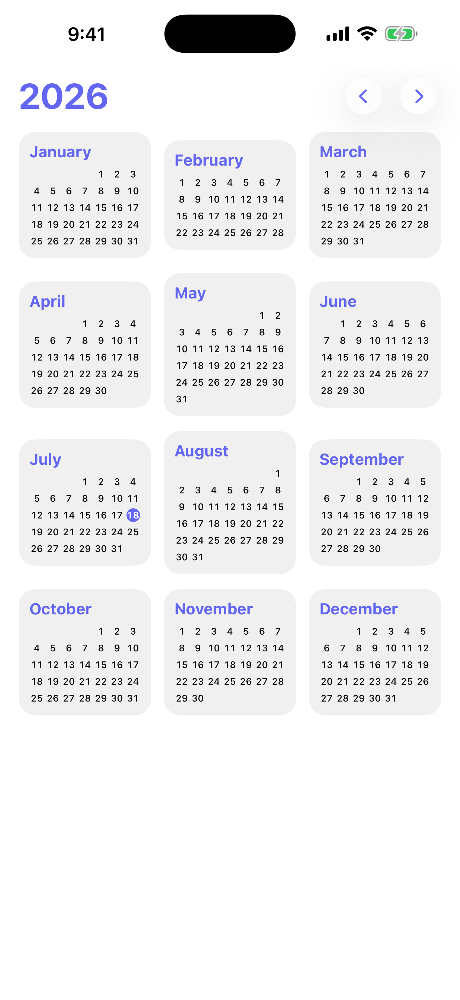
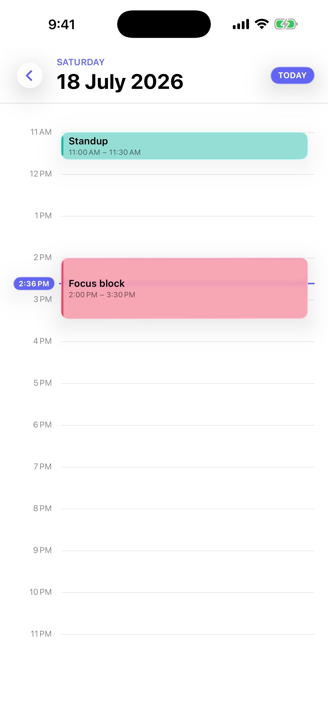
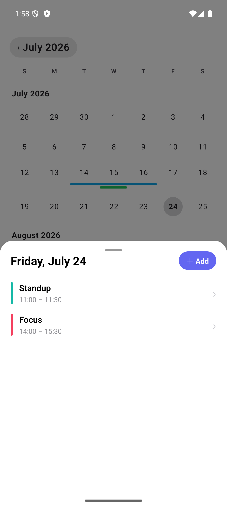
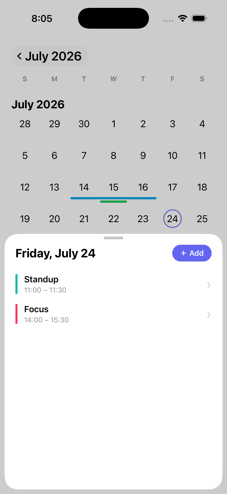
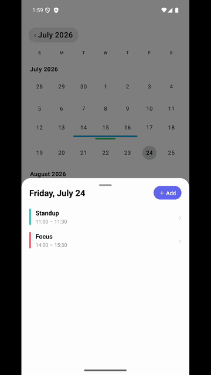
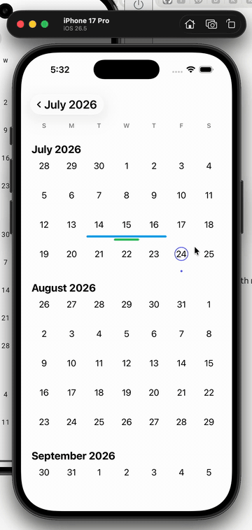

# kalendar

A native calendar for React Native. It draws with SwiftUI on iOS and Jetpack Compose on Android, so paging, the zoom between views, and drag-to-reschedule all run natively and stay smooth.

<p align="center">
  
</p>

## What it does

- Renders natively — SwiftUI on iOS, Compose on Android.
- Month, year, and day views, with a zoom between them.
- Themeable: accent, text, and background colors, corner radius, selection shape, font.
- On iOS 26, selection and event chips use Liquid Glass (`.glassEffect`); below that it's solid fills, and on Android it's translucent Material.
- Works with your own day screen, or the built-in one.
- Honors week start, locale, and 12- or 24-hour time.

## Screenshots

| Month                                                                               | Year                                                                              | Day                                                                             |
| ----------------------------------------------------------------------------------- | --------------------------------------------------------------------------------- | ------------------------------------------------------------------------------- |
|  |  |  |

| Android                                       | iOS                                       |
| --------------------------------------------- | ----------------------------------------- |
|  |  |
|         |         |

## Requirements

- Expo SDK 57+ / React Native 0.81+, with the New Architecture (Fabric) enabled.
- iOS 16.4+. Liquid Glass needs iOS 26; below that it falls back to solid fills.
- Android 7.0+ (`minSdk` 24).

## Install

```sh
npx expo install @d3sm/kalendar
```

## Usage

A month picker:

```tsx
import { KalendarView } from '@d3sm/kalendar';

<KalendarView
  style={{ flex: 1 }}
  selectedDate={date}
  markedDates={['2026-07-03', '2026-07-20']}
  onDayPress={(e) => setDate(e.nativeEvent.date)}
  accentColor='#3b82f6'
  eventEditor
  events={events}
  onEventChange={(e) => update(e.nativeEvent)}
  onEventDelete={(e) => remove(e.nativeEvent.id)}
/>;
```

## Opening a day

Set `dayView` and tapping a day zooms into a native day view — an hour timeline you can drag events around on and pinch to zoom. `daySheet` shows the same thing in a bottom sheet instead.

Want your own screen? Leave both off and handle `onDayPress`. It hands you the day's events (all-day and multi-day first, then timed), which is usually everything you need to route somewhere:

```tsx
<KalendarView
  events={events}
  onDayPress={(e) => {
    const { date, events } = e.nativeEvent; // events on that day
    navigation.navigate('MyDay', { date, events });
  }}
/>
```

`onDayPress` fires on every tap, even with `dayView` on, so you can prefetch or update nearby UI while still using the built-in view.

## Navigating

The props — `month`, `level`, `selectedDate` — cover most navigation. For the rest, like jumping back to today after someone has paged away, there's a `ref`:

```tsx
import { useRef } from 'react';
import { KalendarView, type KalendarViewHandle } from '@d3sm/kalendar';

const cal = useRef<KalendarViewHandle>(null);

<KalendarView ref={cal} events={events} />;

cal.current?.goToToday();
cal.current?.scrollToDate('2026-07-17');
```

Its methods resolve once the view has mounted, so call them from an effect or a handler.
